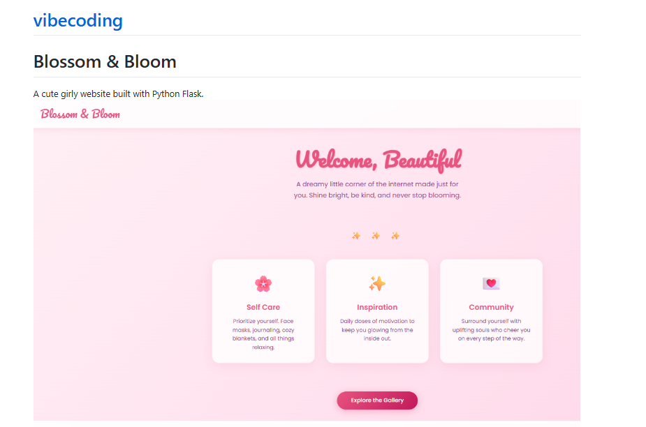
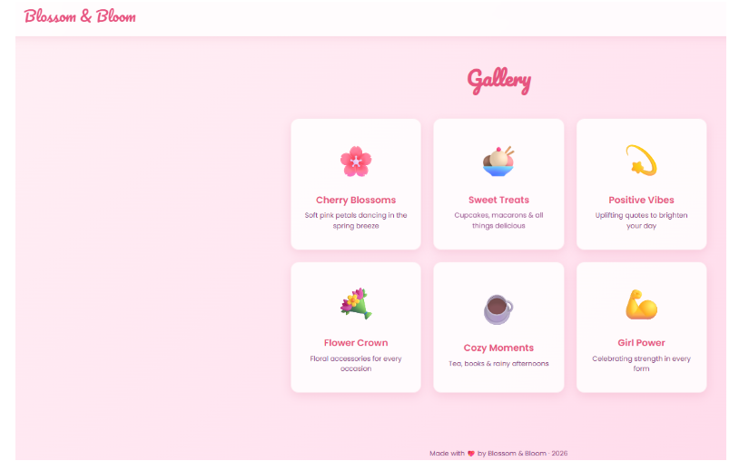

# Blossom & Bloom

A cute girly website built with Python Flask.
![alt text]
![alt text]

## How to Start

### 1. Install Python

Make sure Python 3 is installed. Check by running:

```bash
python --version
```

### 2. Install Flask

```bash
pip install flask
```

### 3. Run the Server

```bash
python app.py
```

### 4. Open the Website

Go to this URL in your browser:

```
http://localhost:5000
```

## Pages

- **Home** - `/`
- **About** - `/about`
- **Gallery** - `/gallery`
- **Contact** - `/contact`

## To Stop the Server

Press `Ctrl + C` in the terminal.

