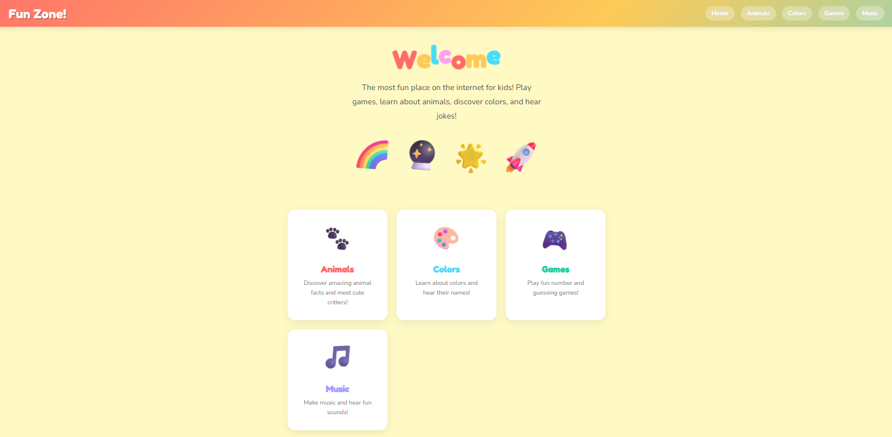
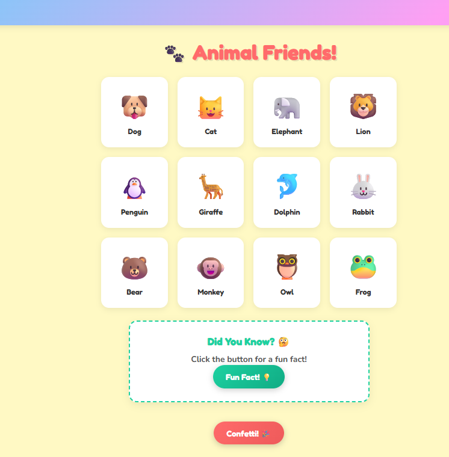
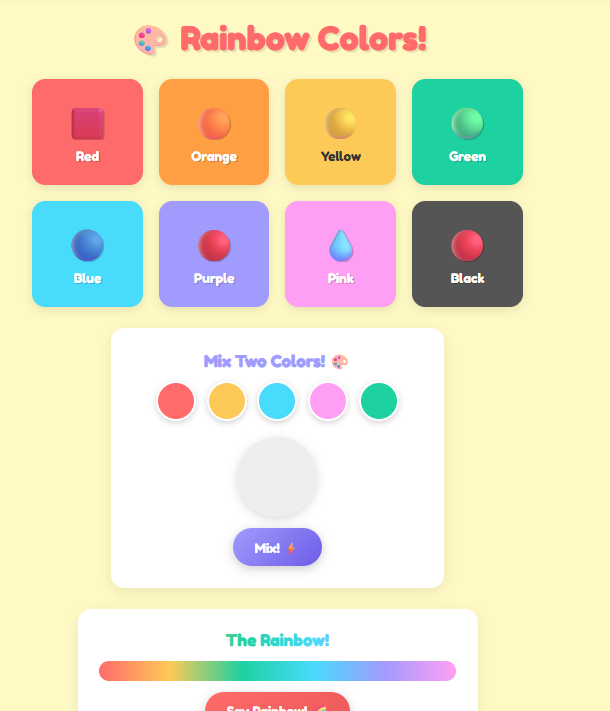
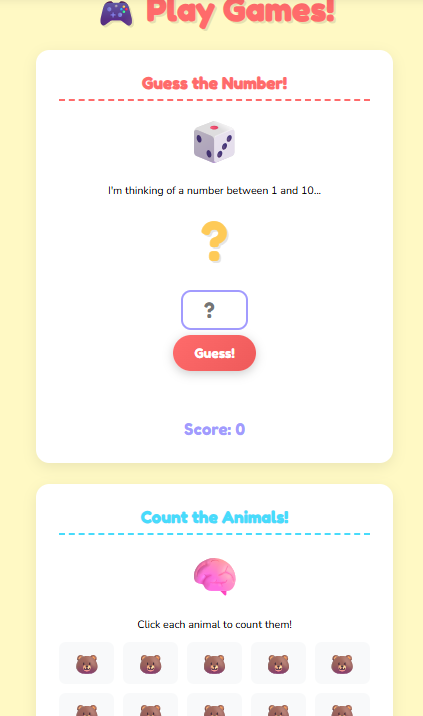
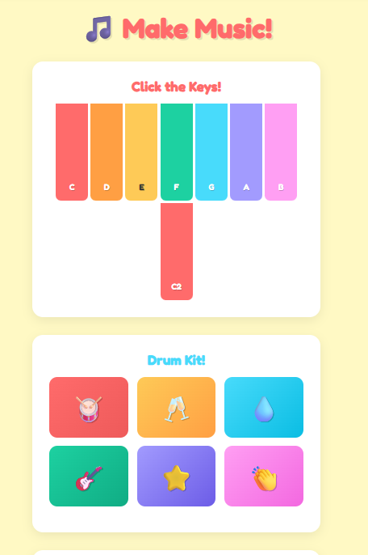

# Fun Zone - Kids Website

A fun, colorful, interactive website for kids built with Python Flask.






## Features

- **Animals** - Click animals to hear their sounds and learn fun facts
- **Colors** - Explore colors, mix them, and hear the rainbow
- **Games** - Number guessing, counting, and silly faces
- **Music** - Play piano, drums, and sing along to songs
- **Jokes** - Funny jokes that will make you laugh
- **Confetti** - Click the confetti button anywhere!

---

## How to Run This Website

### Step 1: Open a Terminal

- **Windows**: Press `Win + R`, type `cmd`, press Enter
- **Mac**: Press `Cmd + Space`, type `Terminal`, press Enter

### Step 2: Go to the Project Folder

Type this command and press Enter:

```bash
cd C:\Users\finla\vibecoding\kids-web
```

### Step 3: Install Flask (Only First Time)

Type this command and press Enter:

```bash
pip install flask
```

Wait for it to finish installing.

### Step 4: Start the Server

Type this command and press Enter:

```bash
python app.py
```

You will see something like:

```
 * Running on http://127.0.0.1:5000
```

### Step 5: Open the Website

Open your web browser (Chrome, Edge, Firefox, etc.) and type this in the address bar:

```
http://localhost:5000
```

Press Enter and the website will open!

### Step 6: Stop the Server

When you are done, go back to the terminal and press:

```
Ctrl + C
```

---

## Pages

| Page | URL | What You Can Do |
|------|-----|-----------------|
| Home | `http://localhost:5000` | See jokes and navigate to other pages |
| Animals | `http://localhost:5000/animals` | Click animals and hear fun facts |
| Colors | `http://localhost:5000/colors` | Learn colors and mix them |
| Games | `http://localhost:5000/games` | Play number and counting games |
| Music | `http://localhost:5000/music` | Play piano and drums |

---

## Troubleshooting

**Problem**: `python` command not found
**Solution**: Try `py` instead of `python`

**Problem**: `pip` command not found
**Solution**: Try `py -m pip install flask`

**Problem**: Port 5000 already in use
**Solution**: Close other programs using that port, or restart your computer
